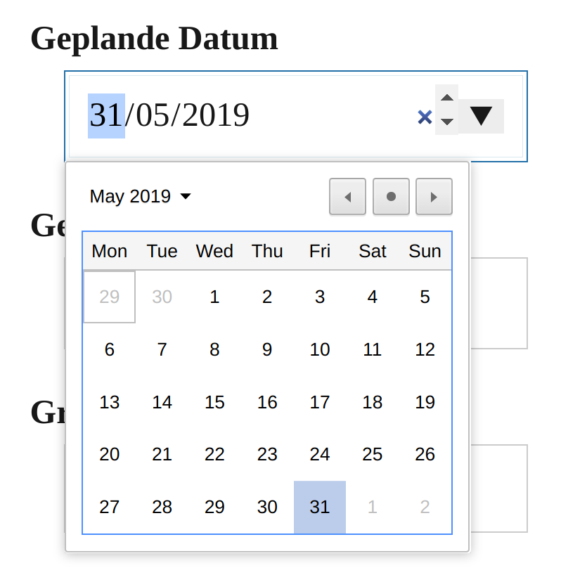
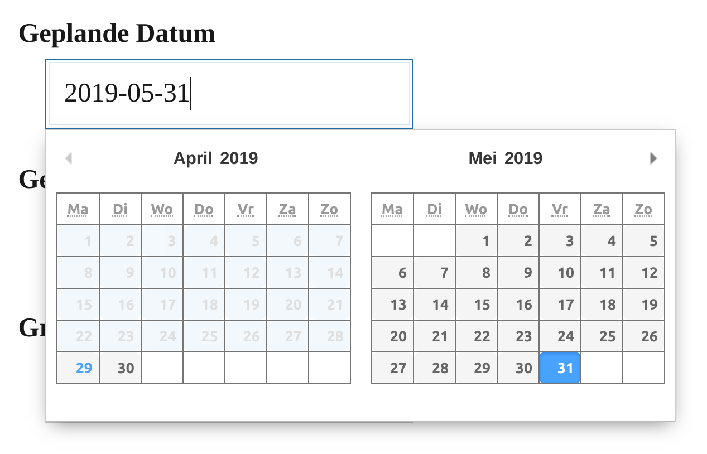
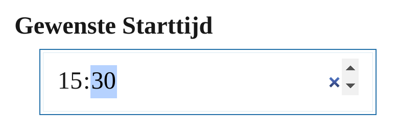

# Recras WordPress plugin

Easily integrate data from your Recras instance, such as packages and contact forms, into your own website.

## Usage
With this plugin, you can easily integrate data from your [Recras](https://recras.nl/) instance, such as packages and contact forms, into your own website.

To get started, go to the Recras → Settings page and enter your Recras name. For example, if you log in to Recras at `https://mysite.recras.nl/` then your Recras name is `mysite`. That's all there is to it! You can now use widgets to retrieve data. All data is retrieved via a secured connection (HTTPS) to ensure data integrity. Other than the request parameters, no data is sent to the Recras servers.

This plugin consists of the following "widgets". To use them, you first need to set your Recras name (see paragraph above).
* Availability calendar
* Contact forms
* Online booking
* Packages
* Products
* Voucher sales
* Voucher info

Widgets can be added to your site in three ways. Using Gutenberg blocks (recommended, since WordPress 5.0 or using the [Gutenberg plugin](https://wordpress.org/plugins/gutenberg/)), using the buttons in the "classic editor", or by entering the shortcode manually (discouraged).

### Date/Time picker
By default, date and time pickers in contact forms use whatever the browser has available. Currently (September 2019) Internet Explorer (all versions) and Safari (desktop) do not have native date/time pickers and only see a text field. We have included a modern looking date picker that you can enable on the Recras → Settings page. For time inputs, a proper fallback is included.

**Note**: this setting only applies to standalone contact forms, not to contact forms used during "new style" online booking.

### Comparison of date/time inputs with and without setting

_Native date picker (excl. Internet Explorer and desktop Safari)_

_Date picker with "Use calendar widget" enabled_

_Native time picker (excl. Internet Explorer and desktop Safari)_

_Fallback time picker (Internet Explorer and desktop Safari)_

### Styling
No custom styling is applied by default, so it will integrate with your site easily. If you want to apply custom styling, see `css/style.css` for all available classes. Be sure to include these styles in your own theme, this stylesheet is not loaded by the plugin!
For styling the date picker, we refer you to the [Pikaday repository](https://github.com/Pikaday/Pikaday). Be sure to make any changes in your own theme or using WordPress' own Customizer.

### Cache
All data from your Recras is cached for up to 24 hours. If you make important changes, such as increasing the price of a product, you can clear the cache to reflect those changes on your site immediately.

## Google Analytics integration
You can enable basic Google Analytics integration by checking "Enable Google Analytics integration?" on the Recras Settings page. This will only work if there is a global `ga` JavaScript object. This should almost always be the case, but if you find out it doesn't work, please contact us!

## Installation

Easy installation (preferred):

1. Install the plugin from the Plugins > Add New page in your WordPress installation.

Self install:

1. Upload the `recras-wordpress-plugin` folder to the `/wp-content/plugins/` directory
1. Activate the plugin through the 'Plugins' menu in WordPress

Using Composer:

1. Type `composer require recras/recras-wordpress-plugin` in your terminal
1. The plugin will automatically be installed in the `/wp-content/plugins/` directory by using Composer Installers
1. Activate the plugin through the 'Plugins' menu in WordPress

## Support

We would appreciate it if you use [our GitHub page](https://github.com/Recras/recras-wordpress-plugin/issues) for bug reports, pull requests and general questions. If you do not have a GitHub account, you can use the Support forum on wordpress.org.

We only support the plugin on the latest version of WordPress (which you should always use anyway!) and only on [actively supported PHP branches](https://www.php.net/supported-versions.php).

## Credits
* Icons from [Dashicons](https://github.com/WordPress/dashicons) by WordPress, released under the GPLv2 licence.
* Date picker is [Pikaday](https://github.com/Pikaday/Pikaday), released under the BSD/MIT licence.
